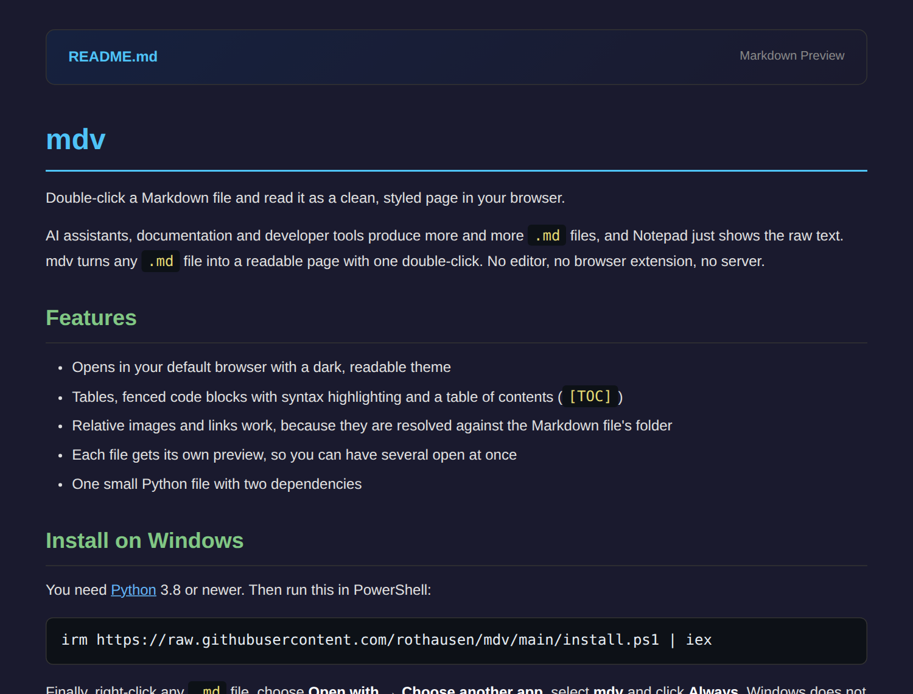

# mdv

Double-click a Markdown file and read it as a clean, styled page in your browser.

AI assistants, documentation and developer tools produce more and more `.md` files, and Notepad just shows the raw text. mdv turns any `.md` file into a readable page with one double-click. No editor, no browser extension, no server.



## Features

- Opens in your default browser with a dark, readable theme
- Tables, fenced code blocks with syntax highlighting and a table of contents (`[TOC]`)
- Relative images and links work, because they are resolved against the Markdown file's folder
- Each file gets its own preview, so you can have several open at once
- One small Python file with two dependencies

## Install on Windows

You need [Python](https://www.python.org/downloads/) 3.8 or newer. Then run this in PowerShell:

```powershell
irm https://raw.githubusercontent.com/rothausen/mdv/main/install.ps1 | iex
```

Finally, right-click any `.md` file, choose **Open with** → **Choose another app**, select **mdv** and click **Always**. Windows does not let scripts change the default app for a file type, so this one click is up to you.

The installer puts mdv in `%USERPROFILE%\bin\mdv`, installs the `markdown` and `pygments` packages, adds mdv to the Open with list and adds the folder to your `PATH`, so `mdv file.md` also works in a new terminal. Everything is per-user and needs no administrator rights. You can [read the script](install.ps1) before running it.

<details markdown="1">
<summary>Manual installation</summary>

Download the repository as a ZIP, unpack it to a permanent folder such as `C:\Users\<you>\bin\mdv`, and install the packages:

```powershell
py -m pip install -r requirements.txt
```

Then right-click any `.md` file, choose **Open with** → **Choose another app** → **Choose an app on your PC**, select `mdv.bat` and click **Always**.

</details>

<details markdown="1">
<summary>Uninstall</summary>

Delete the folder and the Open with entries:

```powershell
Remove-Item -Recurse "$HOME\bin\mdv", "HKCU:\Software\Classes\Applications\mdv.bat"
Remove-Item "HKCU:\Software\Classes\.md\OpenWithList\mdv.bat", "HKCU:\Software\Classes\.markdown\OpenWithList\mdv.bat"
```

Finally, remove `%USERPROFILE%\bin\mdv` from your `PATH`: search the Start menu for **Edit environment variables for your account**.

</details>

## macOS and Linux

```bash
python3 -m pip install -r requirements.txt
python3 mdv.py README.md
```

To use it as a command, add an alias to your shell profile:

```bash
alias mdv='python3 /path/to/mdv/mdv.py'
```

## How it works

mdv converts the Markdown to HTML with [Python-Markdown](https://python-markdown.github.io/), adds a built-in stylesheet and writes the page to an `mdv` folder in your system's temp directory. It then opens that page in your default browser. Your original file is never changed.

To see changes after editing a file, open it again.

## License

MIT. See [LICENSE](LICENSE).
